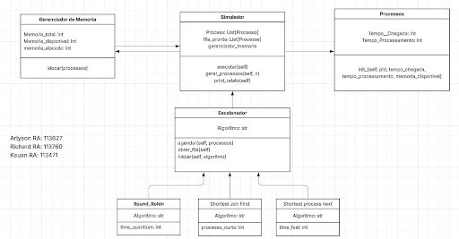

## Grupo:
### Nome: Richard Nicholas Rocha | RA: 113760
### Nome: Arlyson Silva Nascimento | RA: 113627
### Nome: Kauan Melo | RA: 113471

# Simulador de Sistema Operacional

**SimuladorSO** é uma aplicação desenvolvida em C# que visa a simulação detalhada de escalonamento de processos, threads, gerenciamento de memória, E/S e sistema de arquivos em sistemas operacionais. Este projeto oferece uma plataforma para estudo, experimentação e análise de algoritmos clássicos de escalonamento, proporcionando uma visão prática de como os sistemas operacionais gerenciam processos, recursos de memória e dispositivos.

## Funcionalidades Principais

- **Escalonamento de Processos e Threads**
  - Implementa algoritmos como **Round Robin (RR)** com quantum configurável, **Shortest Job First (SJF)** e **Shortest Process Next (SPN)**
  - Contagem de trocas de contexto e logs de eventos
  - Filas de threads prontas, com estados **Pronto, Executando, Bloqueado e Finalizado**

- **Gerenciamento de Memória**
  - Alocação e liberação de memória para processos simulados
  - Bloqueio de processos caso não haja memória suficiente
  - Visualização do estado da memória antes e após execução

- **Threads Simuladas**
  - Threads com identificador, referência ao processo pai, contador de programa (PC) e execução por quantum
  - Execução simulada, finalização automática e retorno à fila caso não terminem no quantum

- **Entrada e Saída (E/S)**
  - Dispositivos simulados: **Disco** e **Impressora**
  - Solicitação de E/S bloqueante sem espera ativa
  - Logs detalhados de início e término de serviço de E/S

- **Sistema de Arquivos Simulado**
  - Estrutura hierárquica de diretórios com raiz `"root"`
  - Criação e listagem de arquivos em diretórios
  - Suporte a metadados simplificados: **nome e tamanho**

- **Métricas e Logs**
  - Logs detalhados de eventos com timestamp
  - Incremento e contagem de **trocas de contexto**
  - Estado final de processos e memória disponível exibidos ao término da simulação

## Arquitetura do Sistema

O projeto é estruturado em classes orientadas a objetos, garantindo modularidade, legibilidade e extensibilidade:

- `Processo`: Representa um processo do sistema, com threads internas, tempo de chegada, tempo de execução e memória necessária
- `ThreadSimulada`: Representa uma thread de usuário, com referência ao processo pai, estado, PC e execução por quantum
- `Escalonador`: Classe abstrata que define a interface para algoritmos de escalonamento
- `RoundRobin`, `ShortestJobFirst` e `ShortestProcessNext`: Implementações concretas de algoritmos de CPU
- `GerenciadorMemoria`: Gerencia alocação, liberação e status da memória
- `DispositivoES`: Representa dispositivos de E/S e filas de solicitações
- `DiretorioSimulado` e `ArquivoSimulado`: Estrutura hierárquica de arquivos e diretórios
- `Simulador`: Classe central que integra todos os módulos, coordenando execução, E/S, memória, arquivos e logs

## Execução do Projeto

1. Certifique-se de possuir o [.NET SDK](https://dotnet.microsoft.com/en-us/download) instalado.
2. Clone o repositório:  
   ```bash
   git clone https://github.com/RichardRocha/simuladorSO.git
3. Acesse o diretório do projeto:
   ```bash
   cd simuladorSO
5. Compile e execute a aplicação:
   ```bash
   dotnet build
   dotnet run
## UML do programa

